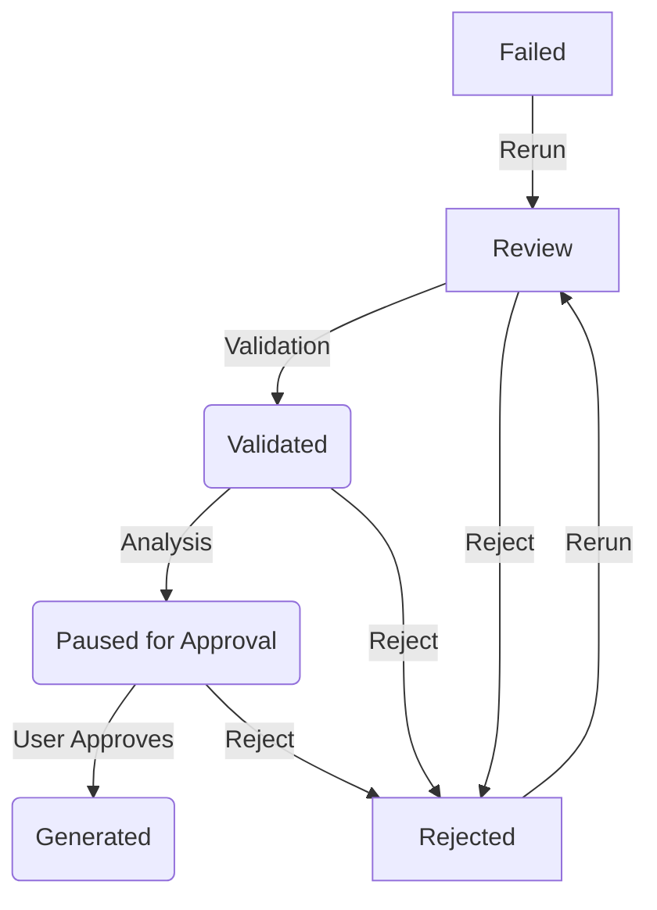

# Opportunity Data Model & State Machine

This document defines the canonical structure for an Opportunity object and its workflow states.

## Top-Level Fields
- `id` (integer): Unique identifier.
- `keyword` (string): The target keyword.
- `status` (string): The current workflow status.
- `strategic_score` (float): The calculated score from 0-100.
- `search_volume` (integer): Monthly search volume.
- `keyword_difficulty` (integer): SEO difficulty from 0-100.
- `main_intent` (string): Primary search intent.
- `cpc` (float): Cost-per-click.
- `blueprint` (object|null): The full analysis blueprint.
- `ai_content` (object|null): The generated content package.
- `strategic_score_narrative` (string|null): AI-generated summary of the score.

## State Machine

